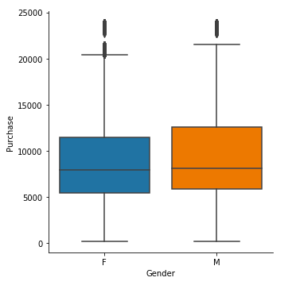
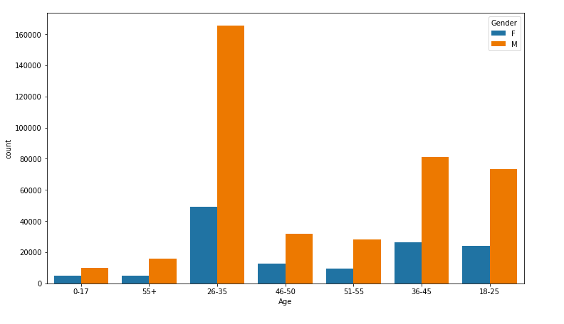

# Big Data and Commercial Data Analytics :smiley: fa18-523-85   

| Bo Li
| bl15@iu.edu
| Indiana University Bloomington
| hid: fa18-523-85 
| github: [:cloud:](https://github.com/cloudmesh-community/fa18-523-85/blob/master/project-report/report.md

## Abstract

As internet developed, online shopping has become part of our daily life. Black Friday, a traditional deal day, has also transformed as a big day for online shopping. The internet retailers, such Amazon, also developed their specific strategy for the combat in online shopping, Amazon Prime Day. In the e-commerce area, the volume of the sales and the product data increased rapidly. It is necessary to develop a cost-effective way to deal with the big data. The technique of relational data management has developed a lot in the last decades. In today's business analysis scenario, the relational technologies seem cannot hold the large data since they are designed to deal with data which is much smaller in size. The developed internet techniques allow us to collect and store the trading data, which could be the most valuable materials for researching customer behaviors. 

## Keywords

Big data, human behavior, data mining, Python   
 
## Introduction

### Commercial Data   

In order to extract the knowledge behind the commercial data generated by hundreds of thousands of consumers for the use of leading managers to make the decision, it is necessary to conduct a deep analysis to the commercial data, instead of generating simple reports. The deep analysis could hardly be done by SQL since the process relies on complex models. Without those models, it is impossible to get a profound understand of the commercial data [@debortoli2014comparing]. People will not only need to find out what is happening now but also need to use data to make some predictions in order to make preparations for future events. For example, if the manager is able to predict the loss of the customer in the future, they can use a discount to attract the users again.   
   
> "The quality of a product or service is an important determinant of consumer satisfaction, brand performance, and long-term brand success" [@tirunillai2014mining].

In the context of big commercial data, the traditional OLAP operations are not enough anymore to meet the requirements, we also need path analysis, time series analysis, graph analysis, what-if analysis, and some complex statistical models. Time series analysis, a useful method in the commercial data analysis since we have got lots of trading historical data [@george2014big]. The managers want to get some patterns in the data in order to find some chances to improve the revenue. By the trend analysis, they can even predict some changes in advance. In the financial area, analysts are able to develop some software to conduct the time series analysis of the trading data and find some profitable trading patterns. After further verification, they can use those profitable trading patterns to conduct real trade and make profits.   

> "Managers and researchers usually obtain measures of perceived quality from customers through surveys or interviews, which are typically based on limited samples administered periodically" [@tirunillai2014mining].   

Large-scale graph and network analysis also play a key role in commercial data analysis. The virtual social network is actually a description of the links between the entities. In the network, every independent entity will be converted to a node in the total graph, and the relationship between nodes will be converted to the link. By conducting a social network analysis, we can find some useful knowledge such as a small community in the whole group. This information could be used to advertise some new product if the community meets the requirement of the target group. We can also combine the individual behavior analysis and the group behavior analysis.   

> "The design decisions that determine what will be measured also stem from interpretation. For example, in the case of social media data, there is a 'data cleaning' process: making decisions about what attributes and variables will be counted, and which will be ignored. This process is inherently subjective" [@boyd2012critical].

### Behavioral Data

> "The study of consumer analytics lies at the junction of Big Data and consumer behavior. Data provide behavioral insights about consumers; marketers translate those insights into market advantage. Analytics generally refers to tools that help find hidden patterns in data" [@erevelles2016big].

Behavioral big data (BBD) refers to very large and rich multidimensional data sets on human and social behaviors, actions, and interactions, which have become available to companies, governments, and researchers. A growing number of researchers in social science and management fields acquire and analyze BBD for the purpose of extracting knowledge and scientific discoveries [@shmueli2017research]. Besides, the online retailers also want to figure out the profound meanings behind the consumer's actions. So the behavioral big data comes across with the research area and industry area, which results in different research methods. We use the methods in the research area to analysis the dataset with specific models designed to the dataset from Kaggle.
   

### Necessity of Big Data

Why we use big data method to conduct the analytics? The answer lies in the character of the real dataset generated in the real trading system. The system records the deal with some specific fields, which could be some information on price, time, discount, product information, product status, etc. The user behavior could also be recorded such as the action of adding to list, the time between an order to payment, etc. If a user has the habit of adding many products to the list but only buy a few of them, you may observe the data and draw the conclusion that the user is rational and could hardly be affected by the advertisement. But if you have the huge amount of data, maybe it is real-time data, the only way to picture those consumers is establishing models and define the features, then use the big data methods to research them. 

> "The opportunities associated with data and analysis in different organizations have helped generate significant interest in commercial data analysis, which is often referred to as the techniques, technologies, systems, practices, methodologies, and applications that analyze critical business data to help an enterprise better understand its business and market and make timely business decisions" [@chen2012business].

The user behavior could also be recorded such as the action of adding to list, the time between an order to payment, etc. If a user has the habit of adding many products to the list but only buy a few of them, you may observe the data and draw the conclusion that the user is rational and could hardly be affected by the advertisement. But if you have the huge amount of data, maybe it is real-time data, the only way to picture those consumers is establishing models and define the features, then use the big data methods to research them. 

## Dataset

### Commercial Data   

The basic concept of commercial data is very easy to understand. The method of analyzing sales data provides a view to having a deep understanding of the sales data, which enables the managers to make a specific plan to conduct some strategies.   

> "Technology's changing pace requires faster market analyses than traditional market analytics can handle. BDA might provide the real-time speed necessary to meet this challenge" [@xu2016effects].

In the process of analysis of the commercial data, they often analyze the historical price, and the design of product line to mine the relationships behind different departments, which could be a still base for a better sale strategy. There are some specific requirements of the commercial data, such as it must be objective and reliable, or it may mislead the decisions of the managers.   

> "They make decisions based on rigorous analysis at more than double the rate of lower performers. The correlation between performance and analytics-driven management has important implications to organizations, whether they are seeking growth, efficiency or competitive differentiation" [@lavalle2011big].

### Dataset Description

The dataset we use here is from a retail store, it contains the information of transactions. To get a profound understand of customer behavior in different things. The first step is to conduct a descriptive analysis of the dataset to get an overview. The second step is to make a deeper study with different variables such as gender, age, city. If the owner wants to find the potential links between different product categories or specific links between a group of people and products, they can do across analysis with different variables. The dataset is an ideal simple for classification and also clustering since all the needed information of the users is provided [@fa18-523-85-kaggle].   

Data columns (total 12 columns): User_ID: 537577 non-null int64, Product_ID: 537577 non-null object, Gender: 537577 non-null object, Age: 537577 non-null object, Occupation: 537577 non-null int64, City_Category: 537577 non-null object, Stay_In_Current_City_Years: 537577 non-null object, Marital_Status: 537577 non-null int64, Product_Category_1: 537577 non-null int64, Product_Category_2: 370591 non-null float64, Product_Category_3: 164278 non-null float64, Purchase: 537577 non-null int64   
  

## Tools

### Python 3.7   
Python is an easy to learn, powerful programming language. It has efficient high-level data structures and a simple but effective approach to object-oriented programming. Python's elegant syntax and dynamic typing, together with its interpreted nature, make it an ideal language for scripting and rapid application development in many areas on most platforms [@fa18-523-85-python].   

### Numpy   
NumPy, which stands for Numerical Python, is a library consisting of multidimensional array objects and a collection of routines for processing those arrays. Using NumPy, mathematical and logical operations on arrays can be performed. This is a tutorial explains the basics of NumPy such as its architecture and environment. It also discusses the various array functions, types of indexing, etc. An introduction to Matplotlib is also provided. All this is explained with the help of examples for better understanding [@fa18-523-85-numpy].   

### Pandas    
Pandas is a Python package providing fast, flexible, and expressive data structures designed to make working with "relational" or "labeled" data both easy and intuitive. It aims to be the fundamental high-level building block for doing practical, real world data analysis in Python. Additionally, it has the broader goal of becoming the most powerful and flexible open source data analysis, manipulation tool available in any language. It is already well on its way toward this goal. Pandas is well suited for many different kinds of data. Tabular data with heterogeneously-typed columns, as in an SQL table or Excel spreadsheet. Ordered and unordered (not necessarily fixed-frequency) time series data. Arbitrary matrix data (homogeneously typed or heterogeneous) with row and column labels. Any other form of observational / statistical data sets. The data actually need not be labeled at all to be placed into a pandas data structure [@fa18-523-85-pandas].   

### Matplotlib.pyplot   
Matplotlib.pyplot is a collection of command style functions that make matplotlib work like MATLAB. Each pyplot function makes some change to a figure: e.g., creates a figure, creates a plotting area in a figure, plots some lines in a plotting area, decorates the plot with labels, etc. In matplotlib.pyplot various states are preserved across function calls, so that it keeps track of things like the current figure and plotting area, and the plotting functions are directed to the current axes (please note that "axes" here and in most places in the documentation refers to the axes part of a figure and not the strict mathematical term for more than one axis) [@fa18-523-85-pyplot].   

### Seaborn   
Seaborn is a Python visualization library for statistical plotting. It comes equipped with preset styles and color palettes so you can create complex, aesthetically pleasing charts with a few lines of code. It is designed to work with NumPy and pandas data structures and to support statistical tasks completed in SciPy and statsmodels. Seaborn is built on top of Python's core visualization library matplotlib, but it's meant to serve as a complement, not a replacement. In most cases, you will still use matplotlib for simple plotting, and you'll need a knowledge of matplotlib to tweak Seaborn's default plots [@fa18-523-85-seaborn].   

## Implementation   
### Data Cleaning   

Data cleaning is a necessary step for the whole process of data cleaning. The result of the data cleaning will have a significant impact on the efficiency of the model and the conclusions. In the practice, data cleaning often takes some time. There is also a domain about how to clean the dataset effectively. When multiple data sources need to be integrated, e.g., in data warehouses, federated database systems or global web-based information systems, the need for data cleaning increases significantly [@rahm2000data].

#### Pre-process   
There are two things need to be done in this step. It is recommended to use the database to store the data since there are lots of advantages of this. If the size of the dataset is too huge to operate in the database, we can also store the data in text and operate it in the Python. The second thing is to have an overview of the data. Checking with the original data is a good way, but the dataset is often too big to get an overview. To extract a sample of the dataset is another choice of this, which will allow you to have the better understanding of the original dataset.   

#### Null test   
The missing value is a common problem of the data analysis, and there are a lot of ways to deal with this problem. We often do this job in four steps. Locate the range of the missing values. In order to distinguish different variables with different importance, we calculate the missing percentage of each part of the dataset. According to the result of the calculation, we use different strategies to deal with those missing values.   

{#fig:fa18-523-85-01-null-test}  
{#fig:fa18-523-85-02-null-show}   

To the part with high importance and low missing rate, we give some values to the missing part by calculating. In some cases, we also use our experience to make up the missing part. To the part with high importance and high missing rate, we will try to fix the problem by finding other data sources. In some troublesome cases, we even delete the whole part of the dataset and claim the action in the result. To the part with low importance and low missing rate, we can care other things or estimate the missing value by some simple calculations. To the part of low importance and high missing rate, we choose to delete the whole part since it can not have a significant impact on the result of the analysis.   

{#fig:fa18-523-85-03-null-fix}   

#### Delete unreasonable value   
It is very common to find some strange value in the dataset. Such as a very big age more than 200. These extreme values will have a negative impact on the result since the features of the dataset will be partly represented by some extreme values.   

### Data Exploration and Processing   

{#fig:fa18-523-85-04-gender}   

In the gender analysis, we can easily find that there are more males than females. The males have contributed more than the female. The result is also linked by the products classes since females have some specific domains to focus on. And the males also have their own preferences.   

{#fig:fa18-523-85-05-gender-sales-box}   
Generally speaking, females are easy to finish the act of purchase even the product is useless to them. Purchasing was an action to meet the need of living, now it has evolved as an action of entertainment. Most of the females have the tendency of purchasing, but they have different degrees about that. Comparing with males, females are less rational in the process. They are easy to be affected by others, which is also a proof of their lack of rationality. On the other hand, females are sensitive to the details of products. Standing by this point, it is hard to make profits on females. So if the designer is able to care more about the details of the products, the products will be more attractive to customers.   

{#fig:fa18-523-85-06-gender-sale-bar}   
The males also have contributed more than the females, about three times to the sales of females. There are some reasons to explain this. Since females are easy to consume without lots of considerations they are often consuming on cheaper things such as thing for daily use.   

{#fig:fa18-523-85-07-age-gender}   

According to the figure, it is obvious that the young people group, especially the young males group, are the main contributors to the sales. Most of them are single or married a few years ago. So they do not have a big burden as other age groups do. They cost of education, the payment of the house, the savings for retirement, these factors are less considered by them. "Men Buy, Women Shop." is a rule that Verde Group found in the research of men and women's behavior of consuming.   

{#fig:fa18-523-85-08-age-mixedgender}

Females are easy to interact with salesman since they are willing to hear some positive feedbacks. But men are more likely to consider other issues such as is there a position for his car, or is the wanted product in stock. In some domains, women invest more than men, such as time, emotions. For men, they are more likely to have a specific plan, once they achieve their goals, they are going to leave the store. Although women have a heavier burden on work, women are stilling playing a role to take care of others. The responsibility of this will help women to have a sharp awareness of shopping and a higher expectation. On the other hand, women have taken the task of shopping for the home for several generations, men could hardly find the fun in shopping.   

{#fig:fa18-523-85-09-age-purchage}   

The behavior of shopping has reflected a lot of differences between male and female. Women are more likely to see shopping as part of their networking since they will get enough topics and materials about the products when talking about other women. In contrast, men are more likely to treat shopping as a task, once they have finished their task, they think they have done with this task and will not stay in the store.   

### Data Analysis and Data Visualization   

{#fig:fa18-523-85-10-city}   

The customers in this dataset are mostly distributed in three main cities. B city has more users than A and C. There are a lot of factors to effect this, such as the city is an industrial city or not, the city has a local big retailer or not. For the big city, people have a higher level of income, so they consume the most. For the subarea, the people usually have some reason to live far from downtown, part of the reason is the price of land and house, so they have a weaker purchase power than the group lives in the big city. Last but not least, the people who live in the countryside have the lowest purchase power.   

{#fig:fa18-523-85-11-city-purchase}   

Surprisingly, C city has the highest sales among the three cities. Although C city does not have the biggest customer group. This may attribute to the features of the customer group in C city. Due to the low purchase and the inconvenience they need to face when planning to go shopping, they have less time and money to invest in shopping. For the group that not live in the downtown, the time and money cost should be considered as a significant factor. In other cases, someone chooses to get the product by mail, which is also a factor that contributes to the lower purchase power of this group. Since they are not able to select and try the product by themselves, they are not willing to take the risk to pay for the mail charge. The group lives in the city is easy to get access to the product and they can get enough information form the salesman, it easy to make the deal since the service will push the deal.   

{#fig:fa18-523-85-12-city-age}   

In each city, the young group after graduation is the main contributor to the sales. As we mentioned before, they are more likely to be single, which means they have less pressure to save money for future use. There are several factors which can affect the sale converting ratio. The most important three are price, transportation, and discount. Part of the online shoppers will accept the suggestions from social media. And nearly half of them will listen to their family members or friends. Some of them are driven by the advertisements. Most of the customers are eager to see the product by themselves, especially for online shoppers. So the comments from the previous buyers will play a significant role in the process of deciding whether to buy the things or not.   

{#fig:fa18-523-85-13-stay-purchase-bar}   

According to this figure, the people who stay in the city for one year have contributed the most part of the sales. Since they have settled down to the city, rather than those who have not to stay in the same city for one year, they have the need to buy things. On the other hand, they have adapted to the environment in the city, so they are more likely to pursue some higher level things.   

{#fig:fa18-523-85-14-stay}   

The first year users in the specific city are the majority of the group. The other kinds of the group are similar in size. The females are enjoying the process of shopping, so they are tending to spend more time to compare different products from different retailers. The discount will lead to the final purchase since they are sensitive to the prices of different products. More than half of the customers will give up the purchase due to the cost of delivery, which should be a key point to improve the sales.   

{#fig:fa18-523-85-15-product-mixed}   

To have a better understanding of the gender and product, we use the marital status to divide the customer and conduct across analysis with a product. In each age group, it is the single male group that consumes a lot than other groups. The single female group contributes more than the married female group. A possible solution is to include the cost of delivery into the price of the product. On one hand, when customers see the price of the product at the first time, the anchor effect will leave them an impression of the price, so the additional fee of delivery will push them to give up the purchase. Showing the whole price at the first time will be a better choice. On the other hand, to serve the customers, the company can establish a stable relationship with those companies, which means a lower delivery price for every customer.   

{#fig:fa18-523-85-16-product1-bar}   

For the first product category, although the top three items have occupied more than half of the sales, it is still more diverse than the second product category. For sales, customer behavior is a key role to care about. The process of decision making is worth to be researched. When people have the plan to consume, there are often two ways to make the decision, high indecision and low in a decision [@liu2014big]. Entering is the time and money they want to invest in the purchase when the strategy has already been decided. There are a lot of factors to affect the entering way, such as the price of the product, the value of the product.   

{#fig:fa18-523-85-17-product2-bar}   

In the second product category, the top one item has occupied most of the sales, which means a single product consists the majority of the revenue. Due to the centralized profit, the economy of the city may have a greater risk than the other two cities. The product category is also one of them. Once the consumer wants to buy a gift for his father, he will spend a lot of time and money on this purchase. As a result, he has a strong tendency to make the deal, and then finish the purchase with an acceptable price. That is an example of high entering. In contrast, for the low entering consumers, they are not going to consider a lot of factors before making the decision, so the band and the preference will affect a lot [@hair2008essentials].   

{#fig:fa18-523-85-18-product3-bar}   

The third product category is similar to the first one, which has more diversity than the second one. Multiple products make up the whole revenue means a diversity in risks. The managers can use a hint to affect the process of making decisions. By endless advertising, they can stimulate the interest of consumers. To make this works, the managers need to find the potential needs of the consumers and convert them to the actual needs. There are two kinds of needs, psychological need and functional need when the manager is able to combine them, he will be successful since the product will meet the expectation of the consumers [@malik2013governing]. For the searching of the information, there are two kinds of storage environments for information. The internal environment contains the previous information, such as the product category in their mind. The external environment contains comments from other uses, differences of a price.    

## Conclusion

In the analysis, we have found that the big data analysis can mine a lot of information behind the dataset. By using big data technologies, we are able to establish a strategy for a business. Such asset a specific strategy for the young group of the consumers [@power2014using]. Also, we are able to make the whole target more clear, especially the blueprint of data, technology, operating. According to the blueprint, we can break down the steps for conducting, which could lead to the practice of big data strategy.   

> "For effective marketing, it is essential to identify a specific group of customers who share similar preferences and respond to a specific marketing signal. Customer segmentation applications can help identify different communities (segments) of customers who may share similar interests" [@fan2015demystifying].

The blueprint of application could help the managers to recognize the value point of big data in two aspects, business model innovation, and business value chain. Based on the big data, we can combine the Internet to conduct the strategy [@donnelly2015digital]. Standing at a higher level, we could design the strategy by considering all the factors. To conduct the strategy on the business value chain, we need to analyze the applications in different scenarios. Use big data in the product design step to catch the needs of consumers, use big data in the product production process to improve the quality of the product, use big data in the sales process to send the information of the product to the targeted group.   

> "Finally, retail managers learn very early in their management training programs that the bottom line for most decisions in retailing is sales" [@turley2000atmospheric].   

The data blueprint could help us to establish the framework and specify the data collection standards. The framework of big data is supported by the classification of the data, which contains basic data of the business, behavior data and the picture data of customers [@chen2014data]. To make the data source clear, we need to divide them into different kinds, internal data from the company, data from the product chain, data from the upper or lower companies and social data. If we can use the technologies in an appropriate way, big data will save us a lot of time [@davenport2013big]. Considering the needs of the company and the tendency, we need to compare different main technologies, from different perspectives. Hardware platform, data storage and management, calculation, data analysis, data visualization, and data safety. Comparing with their advantages and disadvantages, then make the choice of technology. To help the company establish an effective and durable management system, it is necessary to collect the data in the process stream.   

# Acknowledgement   

We would like to thank Professor Gregor von Laszweski for all his support in this project. We would also like to thank the TAs for their support to help me finish this project.
